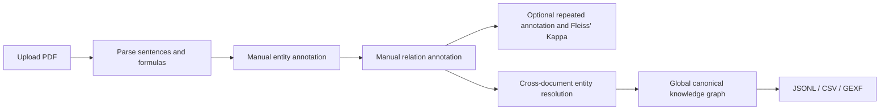

<div align="center">

# KG Annotator

### Human-centered knowledge graph annotation for scientific PDFs

Upload papers, annotate entities and relations manually with unlimited revisions, measure annotation agreement, resolve entities across documents, and export an auditable knowledge graph.

[English](README.md) · [Chinese](README_zh.md)


</div>

---

## Overview

KG Annotator is a local-first annotation workspace for turning domain literature into traceable knowledge graphs. A PDF is parsed and segmented once. Annotators then select entity spans directly in each source sentence or formula, assign entity types, and create typed relations without model-generated candidates.

The first complete manual pass is immediately usable as a knowledge graph. Every later save creates another immutable annotation version, and the graph always uses the latest version. Fleiss' Kappa can be calculated once enough manual versions exist. Name and context embeddings support cross-document entity resolution while preserving every original mention and alias.

## Highlights

| Area | Capabilities |
| --- | --- |
| PDF processing | Page-level extraction, Chinese/English sentence segmentation, standalone formula reconstruction, original-formula snapshots, and surrounding context |
| Manual annotation | Character-accurate spans across previous/current/next sentences, cross-sentence relations, configurable types, Pass and uncertain decisions, and unlimited revisions |
| Agreement | Entity, relation, and overall Fleiss' Kappa across two or more manual annotation versions on reproducible random subsets |
| Knowledge graph | Cross-document canonical aggregation, document/page/sentence provenance, interactive visualization, and global Gephi GEXF export |
| Entity resolution | BigModel `embedding-3`, 85% review threshold, exact-name auto-merge policy, human-selected preferred names, and accumulated aliases |
| Interface | Instant Chinese/English switching with the selected language remembered locally |

## Workflow



## Technology

- **Backend:** FastAPI, SQLAlchemy, Pydantic, PyMuPDF
- **Frontend:** React, TypeScript, Vite
- **Embeddings:** BigModel `embedding-3`
- **Storage:** SQLite for the local MVP

## Quick start

### 1. Backend

```powershell
cd backend
python -m venv .venv
.venv\Scripts\Activate.ps1
pip install -e .[dev]
uvicorn app.main:app --reload --port 8000
```

### 2. Frontend

```powershell
cd frontend
npm install
npm run dev
```

Open [http://localhost:5173](http://localhost:5173). API documentation is available at [http://localhost:8000/docs](http://localhost:8000/docs).

## Model configuration

Copy `.env.example` to `.env` and add the optional embedding provider credentials:

```dotenv
BIGMODEL_API_KEY=your-key
BIGMODEL_EMBEDDING_URL=https://open.bigmodel.cn/api/paas/v4/embeddings
EMBEDDING_MODEL=embedding-3
EMBEDDING_DIMENSIONS=1024
```

Without an API key, annotation remains fully available and entity resolution falls back to local character embeddings.

## Annotation and resolution policy

- Entity boundaries are stored as character offsets; tokenization is only an annotation aid.
- PDF parsing and sentence/formula segmentation happen once; entity and relation extraction is manual.
- Every save creates an immutable version, with no revision limit; the current graph uses the latest version.
- Fleiss' Kappa uses a configurable number of the latest manual versions for sentences with enough saved versions.
- Only exactly identical names with at least 99% combined similarity are merged automatically.
- Differently named candidates require a human choice of preferred name; scores from 85% upward are presented for review.
- A merged entity's `aliases` collect both preferred names and all historical aliases.
- Rejected merge pairs are remembered and are not proposed again.
- Merging preserves original mentions and provenance down to document, page, and sentence.

## Data privacy

The repository is configured to exclude local research and credentials. The following remain on the user's machine and are ignored by Git:

- `.env` and API keys
- uploaded PDF files
- SQLite databases and annotation records
- generated formula images and temporary files
- dependencies, caches, and build output

## Current scope

This repository contains a runnable MVP for text-based PDFs. OCR for scanned documents, multi-user permissions, advanced layout coordinates, and a Neo4j publication layer are planned extensions.

---

<div align="center">
Built for transparent, reviewable scientific knowledge extraction.
</div>
