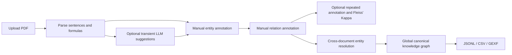

<div align="center">

# KG Annotator

### Human-centered knowledge graph annotation for scientific PDFs

Upload papers, annotate entities and relations manually with unlimited revisions, measure annotation agreement, resolve entities across documents, and export an auditable knowledge graph.

[English](README.md) · [Chinese](README_zh.md)


</div>

---

## Overview

KG Annotator is a local-first annotation workspace for turning domain literature into traceable knowledge graphs. A PDF is parsed and segmented once. Annotators select entity spans directly in each source sentence or formula, assign entity types, and create typed relations. An optional on-demand LLM assistant can prepare transient suggestions, but it never writes annotation data automatically: the annotator must explicitly apply, edit, and save every result.

The first complete manual pass is immediately usable as a knowledge graph. Every later save creates another immutable annotation version, and the graph always uses the latest version. Fleiss' Kappa can be calculated once enough manual versions exist. Name and context embeddings support cross-document entity resolution while preserving every original mention and alias.

## Highlights

| Area | Capabilities |
| --- | --- |
| PDF processing | MinerU VLM structured parsing, LaTeX-preserving equations, page-aware sentence splitting, source-equation screenshots, and a local PyMuPDF fallback |
| Manual annotation | Character-accurate spans across previous/current/next sentences, cross-sentence relations, configurable types, Pass and uncertain decisions, and unlimited revisions |
| Optional LLM assistance | One-click, single-sentence entity/relation suggestions that remain transient until a human explicitly applies and saves them |
| Agreement | Entity, relation, and overall Fleiss' Kappa across two or more manual annotation versions on reproducible random subsets |
| Knowledge graph | Cross-document canonical aggregation, document/page/sentence provenance, interactive visualization, and global Gephi GEXF export |
| Entity resolution | BigModel `embedding-3`, 85% review threshold, exact-name auto-merge policy, human-selected preferred names, and accumulated aliases |
| Interface | Instant Chinese/English switching with the selected language remembered locally |

## Workflow



## Technology

- **Backend:** FastAPI, SQLAlchemy, Pydantic, PyMuPDF
- **Frontend:** React, TypeScript, Vite
- **Embeddings:** BigModel `embedding-3`
- **Storage:** SQLite for the local MVP

## Project structure

```text
KG-annotated/
├── run.py                     # Starts backend and frontend together
├── config/                    # Ontology and LLM prompt templates
├── data/                      # Local data and parse artifacts (Git-ignored)
├── backend/
│   ├── app/                   # FastAPI, configuration, database models, and API
│   └── services/
│       ├── document/          # PDF parsing, MinerU, cleaning, and deletion
│       ├── annotation/        # Human annotations and revision history
│       ├── evaluation/        # Fleiss' Kappa over manual revisions
│       └── kg/                # Optional suggestions, KG construction/export, and resolution
└── frontend/                  # React annotation interface
```

## Quick start

Requirements: Python 3.11+, Node.js 18+, and npm. From the project root:

```powershell
python -m venv .venv
.venv\Scripts\Activate.ps1
pip install -e ".\backend[dev]"
npm install --prefix frontend
Copy-Item .env.example .env
```

Then start both services:

```powershell
python run.py --open
```

This starts the backend at `http://127.0.0.1:8000` and the frontend at `http://127.0.0.1:5173`. Use `--backend-port`, `--frontend-port`, `--host`, and `--no-reload` to customize it.

### 1. Backend

```powershell
cd backend
python -m venv .venv
.venv\Scripts\Activate.ps1
pip install -e .[dev]
uvicorn app.main:app --reload --port 8000
```

### 2. Frontend

```powershell
cd frontend
npm install
npm run dev
```

Open [http://localhost:5173](http://localhost:5173). API documentation is available at [http://localhost:8000/docs](http://localhost:8000/docs).

## Model configuration

All credentials are optional. Manual annotation works without any external model. To enable on-demand DeepSeek suggestions:

```dotenv
DEEPSEEK_API_KEY=your-key
LLM_BASE_URL=https://api.deepseek.com
LLM_MODEL=deepseek-chat
```

Suggestions are generated only after the annotator clicks the assistant button. They are not persisted until explicitly applied and saved.

To enable embedding-assisted cross-document entity resolution:

```dotenv
BIGMODEL_API_KEY=your-key
BIGMODEL_EMBEDDING_URL=https://open.bigmodel.cn/api/paas/v4/embeddings
EMBEDDING_MODEL=embedding-3
EMBEDDING_DIMENSIONS=1024
```

Without an API key, annotation remains fully available and entity resolution falls back to local character embeddings.

High-quality PDF parsing uses `auto` mode by default: it selects MinerU VLM when a key is configured and otherwise falls back to local PyMuPDF parsing.

```dotenv
PDF_PARSER=auto
MINERU_API_KEY=your-key
MINERU_POLL_INTERVAL=5
MINERU_POLL_TIMEOUT=900
```

The MinerU path preserves inline and display LaTeX before structuring the paper into body text, equations, figures/tables, and references. Headers, footers, figure/table content, and references are excluded from the annotation queue.

Each MinerU document produces `label_structure.json`, `label_structure_cleaned.json`, and a final `document.md`. Download the clean Markdown from `GET /api/documents/{document_id}/clean-markdown`; database sentences are generated from the same cleaned structure.

## Annotation and resolution policy

- Entity boundaries are stored as character offsets; tokenization is only an annotation aid.
- PDF parsing and sentence/formula segmentation happen once. Annotation is human-controlled; optional LLM suggestions are transient and never auto-saved.
- Every save creates an immutable version, with no revision limit; the current graph uses the latest version.
- Fleiss' Kappa uses a configurable number of the latest manual versions for sentences with enough saved versions.
- Only exactly identical names with at least 99% combined similarity are merged automatically.
- Differently named candidates require a human choice of preferred name; scores from 85% upward are presented for review.
- A merged entity's `aliases` collect both preferred names and all historical aliases.
- Rejected merge pairs are remembered and are not proposed again.
- Merging preserves original mentions and provenance down to document, page, and sentence.

## Data privacy

The repository is configured to exclude local research and credentials. The following remain on the user's machine and are ignored by Git:

- `.env` and API keys
- uploaded PDF files
- SQLite databases and annotation records
- generated formula images and temporary files
- dependencies, caches, and build output

## Current scope

This repository contains a runnable MVP for text-based PDFs. OCR for scanned documents, multi-user permissions, advanced layout coordinates, and a Neo4j publication layer are planned extensions.

## Verification

```powershell
cd backend
python -m pytest -q

cd ..\frontend
npm run build
```

---

<div align="center">
Built for transparent, reviewable scientific knowledge extraction.
</div>
