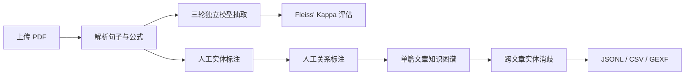

<div align="center">

# KG Annotator

### 面向科研 PDF 的人工知识图谱标注工具

上传论文、人工标注实体与关系、评估三轮独立抽取、执行跨文章实体消歧，并导出证据可追溯的知识图谱。

[English](README.md) · [中文](README_zh.md)


</div>

---

## 项目简介

KG Annotator 是一个本地优先的领域文献知识图谱标注工作台。标注员直接在原始句子或公式中划选实体边界、指定实体类型，并创建有类型的关系。模型输出与人工标注界面相互隔离，避免模型候选影响人工判断。

后台保留三轮独立抽取，用于可复现的 Fleiss' Kappa 一致性评估。人工审核完成后，系统通过名称和上下文 embedding 辅助跨文章实体消歧，同时保留全部原始 mention、别名和证据来源。

## 核心能力

| 模块 | 能力 |
| --- | --- |
| PDF 处理 | 按页解析、中英文分句、独立公式重建、PDF 原式截图与前后文关联 |
| 人工标注 | 字符级实体边界、可配置实体类型、丰富的关系词表、按实体类型推荐关系、Pass 与不确定状态 |
| 一致性评估 | 在可复现的随机句子子集上计算实体、关系和总体 Fleiss' Kappa |
| 知识图谱 | 单篇文章聚合、证据追溯、网页关系网络、JSONL、CSV 与 Gephi GEXF 导出 |
| 实体消歧 | BigModel `embedding-3`、85% 人工候选阈值、同名自动合并、人工选择规范名称、aliases 汇总 |
| 双语界面 | 中文／English 即时切换，并在浏览器本地记住语言选择 |

## 工作流程



## 技术栈

- **后端：** FastAPI、SQLAlchemy、Pydantic、PyMuPDF、LangChain
- **前端：** React、TypeScript、Vite
- **大模型：** 兼容 OpenAI 的结构化输出接口，已使用 DeepSeek 测试
- **Embedding：** BigModel `embedding-3`
- **存储：** MVP 阶段使用 SQLite

## 快速启动

### 1. 后端

```powershell
cd backend
python -m venv .venv
.venv\Scripts\Activate.ps1
pip install -e .[dev]
uvicorn app.main:app --reload --port 8000
```

### 2. 前端

```powershell
cd frontend
npm install
npm run dev
```

打开 [http://localhost:5173](http://localhost:5173)。API 文档位于 [http://localhost:8000/docs](http://localhost:8000/docs)。

## 模型配置

复制 `.env.example` 为 `.env`，然后填写需要使用的模型凭据：

```dotenv
DEEPSEEK_API_KEY=your-key
LLM_BASE_URL=https://api.deepseek.com
LLM_MODEL=deepseek-chat

BIGMODEL_API_KEY=your-key
BIGMODEL_EMBEDDING_URL=https://open.bigmodel.cn/api/paas/v4/embeddings
EMBEDDING_MODEL=embedding-3
EMBEDDING_DIMENSIONS=1024
```

未配置 API Key 时，后端会使用可离线运行的规则型演示抽取器和本地字符向量。

## 标注与实体消歧原则

- 实体边界以字符偏移量存储，分词仅作为标注辅助。
- 三次模型原始输出与人工最终标注分别保存。
- 模型候选不会在人工标注页面预填或展示。
- 只有名称完全相同且综合相似度达到 99% 的实体才会自动合并。
- 名称不同的候选必须由人工选择规范名称；相似度达到 85% 的候选会进入人工审核。
- 合并后的 `aliases` 汇总两侧规范名称及全部历史别名。
- 人工拒绝的实体对会被记住，后续不再重复出现。
- 实体合并不删除原始 mention，全部事实均可追溯到文档、页码和句子。

## 数据隐私

仓库默认排除本地研究数据和凭据。以下内容只保留在用户电脑中，不会被 Git 提交：

- `.env` 与 API Key
- 上传的 PDF 文件
- SQLite 数据库和标注记录
- 公式截图与临时文件
- 依赖、缓存和构建产物

## 当前范围

当前仓库是面向文本型 PDF 的可运行 MVP。扫描件 OCR、多人权限、复杂版面坐标与 Neo4j 发布层作为后续扩展方向。

---

<div align="center">
让科研知识抽取过程透明、可审核、可追溯。
</div>
