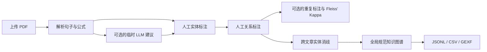

<div align="center">

# KG Annotator

### 面向科研 PDF 的人工知识图谱标注工具

上传论文、以不限次数的版本人工标注实体与关系、评估标注一致性、执行跨文章实体消歧，并导出证据可追溯的知识图谱。

[English](README.md) · [中文](README_zh.md)


</div>

---

## 项目简介

KG Annotator 是一个本地优先的领域文献知识图谱标注工作台。PDF 只解析和分句一次，之后由标注员直接在原始句子或公式中划选实体边界、指定实体类型，并创建有类型的关系。系统可按需生成一次性的 LLM 辅助建议，但不会自动写入标注数据；每条结果都必须由人工明确应用、调整并保存。

首轮人工标注完成后，知识图谱即可直接使用。之后每次保存都会形成不可变的标注版本，图谱始终采用最新版本，修订次数不设上限。当人工版本数量足够时，可计算 Fleiss' Kappa。系统还通过名称和上下文 embedding 辅助跨文章实体消歧，同时保留全部原始 mention、别名和证据来源。

## 核心能力

| 模块 | 能力 |
| --- | --- |
| PDF 处理 | MinerU VLM 结构化解析、LaTeX 公式保真、按页分句、PDF 原式截图与前后文关联；PyMuPDF 可作为本地后备 |
| 人工标注 | 可在前文／本句／后文进行字符级实体划选、建立跨句关系、配置类型，并支持 Pass、不确定状态与不限次数修订 |
| 可选 LLM 辅助 | 点击后仅针对当前句生成临时实体／关系建议，必须由人工明确应用并保存 |
| 一致性评估 | 对两个及以上人工标注版本，在可复现的随机句子子集上计算实体、关系和总体 Fleiss' Kappa |
| 知识图谱 | 跨文档规范实体聚合、文档／页码／句子证据追溯、网页关系网络与全局 Gephi GEXF 导出 |
| 实体消歧 | BigModel `embedding-3`、85% 人工候选阈值、同名自动合并、人工选择规范名称、aliases 汇总 |
| 双语界面 | 中文／English 即时切换，并在浏览器本地记住语言选择 |

## 工作流程



## 技术栈

- **后端：** FastAPI、SQLAlchemy、Pydantic、PyMuPDF
- **前端：** React、TypeScript、Vite
- **Embedding：** BigModel `embedding-3`
- **存储：** MVP 阶段使用 SQLite

## 项目结构

```text
KG-annotated/
├── run.py                     # 同时启动后端和前端
├── config/                    # 本体与 LLM 提示词模板
├── data/                      # 本地数据与解析产物（Git 忽略）
├── backend/
│   ├── app/                   # FastAPI、配置、数据库模型与 API
│   └── services/
│       ├── document/          # PDF 解析、MinerU、清洗与文档删除
│       ├── annotation/        # 人工标注与版本记录
│       ├── evaluation/        # 基于人工版本的 Fleiss' Kappa
│       └── kg/                # 可选建议、KG 构建／导出与实体消歧
└── frontend/                  # React 标注界面
```

## 快速启动

运行要求：Python 3.11+、Node.js 18+ 和 npm。在项目根目录执行：

```powershell
python -m venv .venv
.venv\Scripts\Activate.ps1
pip install -e ".\backend[dev]"
npm install --prefix frontend
Copy-Item .env.example .env
```

随后同时启动前后端：

```powershell
python run.py --open
```

默认启动后端 `http://127.0.0.1:8000` 和前端 `http://127.0.0.1:5173`。可通过 `--backend-port`、`--frontend-port`、`--host` 和 `--no-reload` 调整。

### 1. 后端

```powershell
cd backend
python -m venv .venv
.venv\Scripts\Activate.ps1
pip install -e .[dev]
uvicorn app.main:app --reload --port 8000
```

### 2. 前端

```powershell
cd frontend
npm install
npm run dev
```

打开 [http://localhost:5173](http://localhost:5173)。API 文档位于 [http://localhost:8000/docs](http://localhost:8000/docs)。

## 模型配置

所有模型凭据均为可选项；不配置外部模型也可完整进行人工标注。若要启用按需 DeepSeek 建议：

```dotenv
DEEPSEEK_API_KEY=your-key
LLM_BASE_URL=https://api.deepseek.com
LLM_MODEL=deepseek-chat
```

只有标注员点击辅助按钮后才会请求建议，结果在人工明确应用并保存前不会进入数据库。

若要启用跨文档实体消歧的 Embedding 辅助：

```dotenv
BIGMODEL_API_KEY=your-key
BIGMODEL_EMBEDDING_URL=https://open.bigmodel.cn/api/paas/v4/embeddings
EMBEDDING_MODEL=embedding-3
EMBEDDING_DIMENSIONS=1024
```

未配置 API Key 时，人工标注仍可完整使用；实体消歧会回退到本地字符向量。

高质量 PDF 解析默认采用 `auto`：配置 MinerU 密钥后自动使用 VLM 版面解析，未配置时回退到本地 PyMuPDF。可在 `.env` 中显式选择：

```dotenv
PDF_PARSER=auto
MINERU_API_KEY=your-key
MINERU_POLL_INTERVAL=5
MINERU_POLL_TIMEOUT=900
```

MinerU 结果会先保留行内／独立 LaTeX 公式，再按正文、公式、图表和参考文献结构清理；页眉页脚、图表内容与参考文献不会进入人工正文标注队列。

每篇 MinerU 文档都会生成三份可追溯清洗产物：`label_structure.json`、`label_structure_cleaned.json` 和最终 `document.md`。可通过 `GET /api/documents/{document_id}/clean-markdown` 下载干净 Markdown；数据库分句与该文件使用同一份清洗结构。

## 标注与实体消歧原则

- 实体边界以字符偏移量存储，分词仅作为标注辅助。
- PDF 解析、句子与公式划分只执行一次；标注由人工控制，可选 LLM 建议是临时结果且不会自动保存。
- 每次保存均形成不可变版本，修订次数不限；当前知识图谱使用最新版本。
- Fleiss' Kappa 可指定参与计算的最近人工版本数，仅使用版本数足够的句子。
- 只有名称完全相同且综合相似度达到 99% 的实体才会自动合并。
- 名称不同的候选必须由人工选择规范名称；相似度达到 85% 的候选会进入人工审核。
- 合并后的 `aliases` 汇总两侧规范名称及全部历史别名。
- 人工拒绝的实体对会被记住，后续不再重复出现。
- 实体合并不删除原始 mention，全部事实均可追溯到文档、页码和句子。

## 数据隐私

仓库默认排除本地研究数据和凭据。以下内容只保留在用户电脑中，不会被 Git 提交：

- `.env` 与 API Key
- 上传的 PDF 文件
- SQLite 数据库和标注记录
- 公式截图与临时文件
- 依赖、缓存和构建产物

## 当前范围

当前仓库是面向文本型 PDF 的可运行 MVP。扫描件 OCR、多人权限、复杂版面坐标与 Neo4j 发布层作为后续扩展方向。

## 验证项目

```powershell
cd backend
python -m pytest -q

cd ..\frontend
npm run build
```

---

<div align="center">
让科研知识抽取过程透明、可审核、可追溯。
</div>
